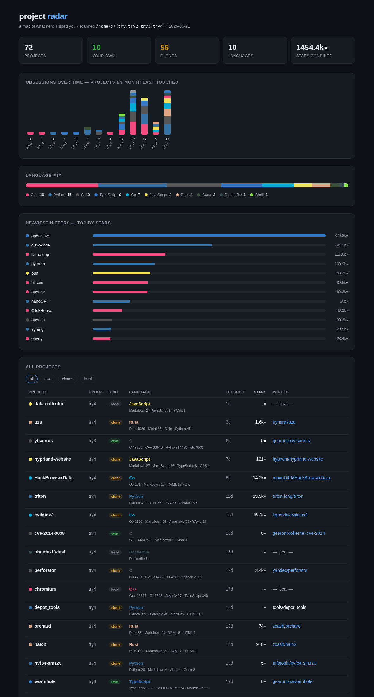

# project radar

A little Rust CLI that scans your `~/try*` dirs and maps your coding obsessions:
which projects are **your own** vs **clones**, their **primary language**
(colored with GitHub's linguist palette), when you **last touched** them, and
their **GitHub stars**. Renders a colored terminal table + a self-contained
`radar.html` dashboard.

Pure std — no third-party crates. It shells out to `git` and (optionally) `gh`.



## Build & run

```sh
cargo build --release
./target/release/radar              # scan ~/try*  -> CLI + ./radar.html
```

## Options

```
--root DIR     parent dir to scan         (default: ~)
--glob PAT     subdir glob under root      (default: try*)
--out FILE     html output path            (default: ./radar.html)
--no-stars     skip the GitHub API (fast / fully offline)
--open         open the dashboard when done
```

Examples:

```sh
./target/release/radar --root ~/c --glob '*'      # scan everything under ~/c
./target/release/radar --no-stars                 # offline, instant
./target/release/radar --open                     # open in browser
```

## How it classifies things

- **own / clone / local** — from `git remote origin`. If the owner is you
  (auto-detected via `gh api user`, plus `gearonixx`/`anarchic`) it's *own*;
  any other remote is a *clone*; no remote is *local*.
- **language** — tallies tracked files (`git ls-files`, falling back to a
  capped directory walk) by extension, preferring a real language over
  docs/config noise. Colors match github.com.
- **last touched** — last commit time, else newest file mtime.
- **stars** — `gh api repos/{owner}/{repo}`, fetched in parallel and cached in
  `~/.cache/project-radar-stars.tsv` so re-runs are instant.

## The dashboard

- header stats (projects / own / clones / languages / combined stars)
- **obsessions over time** — projects stacked by language, per month last touched
- **language mix** — proportional bar + legend
- **heaviest hitters** — top repos by stars
- **all projects** — filter by kind, click any column header to sort

## Layout

```
src/main.rs     args, star fetching + cache, orchestration
src/scan.rs     discovery, remote parsing, language + last-activity detection
src/render.rs   colored CLI table + HTML dashboard
src/lang.rs     extension→language map + linguist colors
src/util.rs     shell-out, parallel map, civil-date/time, html escaping
```
